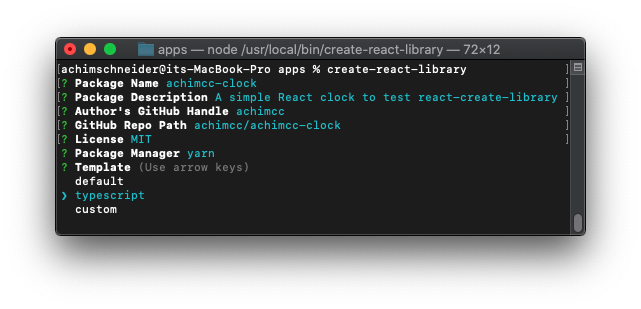
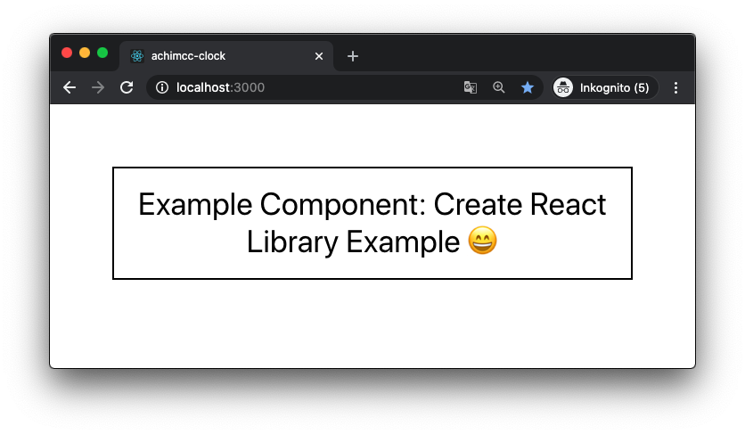
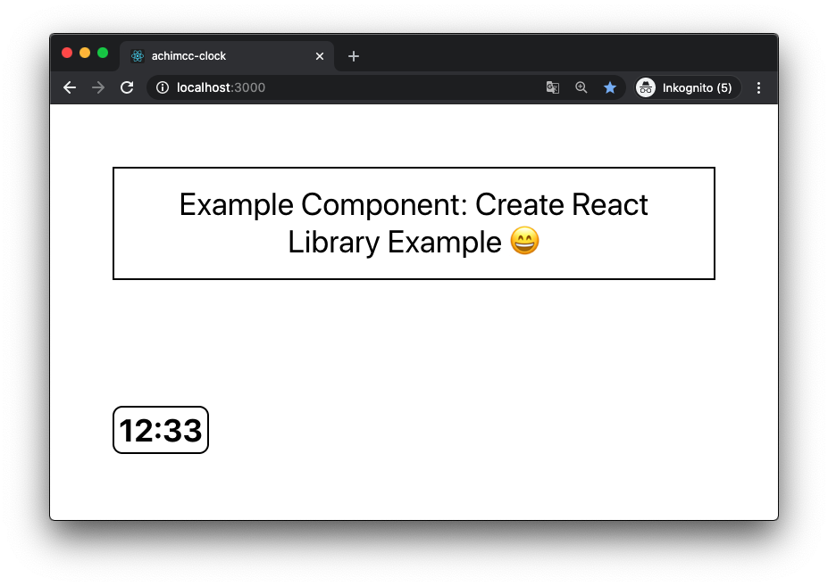

I show how to set up a react library which I publish to Github, so I can import it into a React project as a dependency. There is a powerful tool which allows to do a boilerplate approach to build a library: [create-react-library](https://www.npmjs.com/package/create-react-library).

Further, I wish to implement unit tests which allow me to test my library’s components.

First, we install [create-react-library]:

```
npm install -g create-react-library
```

We create a boilerplate react library by typing:

```
create-react-library
```

First, we choose a name for the package. Since I prefer to focus on the technical details of setting up a library together with a testing framework, I decide to develop a simple Clock component, whose only purpose is to receive hours and minutes as props and to render the time out of it.

Therefore, I enter 'achimcc-clock' as package name, and 'A simple React clock' as package description. Next, I enter my GitHub user name (achimcc) and the path to my Github repository (achimcc/achimcc-clock). For the license, I just hit return to publish my module under the MIT license. I select yarn as package manager and typescript as a template, since I develop a TypeScript app:

That's it, we've created a React Typescript library. Next we start the development server of the library with:

```
cd achimcc-clock && yarn start
```

The library has an example component included and also an example app which imports this component. Hence, we can now open a new shell, and type:

```
cd achimcc-clock/example && yarn start
```

To start a watch script which starts a dev server. Now our pre-made app, importing and using our pre-made component, we can access it locally by our web-browser on https://localhost:3000



Next, we can add a new file clock.tsx to the source directory of our library, implementing a simple clock:

```javascript
// /src/clock.tsx:

import * as React from 'react';
import styles from './styles.module.css';

interface Props {
  hours: number;
  minutes: number;
}

const append = (digit: number): string => {
  if (digit < 10) return `0${digit}`;
  else return `${digit}`;
};

const Clock = ({ hours, minutes }: Props) => {
  return (
    <div className={styles.clock}>
      {append(hours)}:{append(minutes)}
    </div>
  );
};

export default Clock;
```

And add the CSS definitions to the styles.module.css file:

```css
/* /src/styles.module.css: */

.clock {
  padding: 4px;
  border: 2px solid #000;
  border-radius: 10px;
  display: inline-block;
}
```

We add to lines to index.tsx, since we want to export our new clock component:

```javascript
// /src/index.tsx:

import React from 'react';
import { ExampleComponent, Clock } from 'achimcc-clock';
import 'achimcc-clock/dist/index.css';

const App = () => {
  return (
    <div>
      <ExampleComponent text="Create React Library Example 😄" />
      <h1>Our new Clock component:</h1>
      <Clock hours={12} minutes={33} />
    </div>
  );
};

export default App;
```

Finally, we open the App.tsx file under example/App.tsx so we can import and render our new Clock component besides the pre-made component:

```javascript
// /example/src/App.tsx:

import React from 'react';

import { ExampleComponent, Clock } from 'clock';
import 'achimcc-clock/dist/index.css';

const App = () => {
  return (
    <div>
      <ExampleComponent text="Create React Library Example 😄" />
      <Clock hours={12} minutes={33} />
    </div>
  );
};

export default App;
```

That's it:



Now we are ready to deploy the library to GitHub. For this, I first create a new repository on my GitHub account: https://github.com/achimcc/achimcc-clock.git.

Then I add the origin to my local project:

```
git remote add origin https://github.com/achimcc/achimcc-clock.git
```

### Publishing to npm

Now we want to make the library available as a npm repo. For this, we first need a npm account, which can get from here: [npmjs](https://www.npmjs.com/).

Then, in the library’s root directory, type:

```
yarn login
```

Now enter your username and password. Then we can publish the library, by typing:

```
yarn deploy
```
