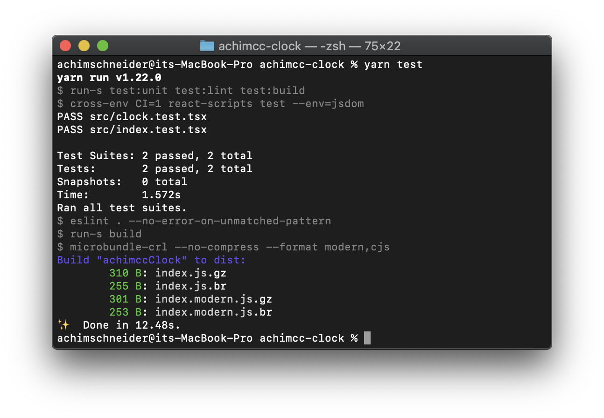

I continue to work with the clock library described in my last post. This time I want to add testing functionalities to my new component. Following a TDD (Test Driven Development) approach, we would write the tests before implementing the component. But for educational purposes I'll do it the other way around this time.

### Testing with Jest

[create-react-library](https://www.npmjs.com/package/create-react-library) already includes Jest for testing. Being in the root project directory to execute the tests, we just have to run:

```
yarn test
```

tto run the tests. However, testing with ESLint fails first in my case, and I needed to add --no-error-on-unmatched-pattern to the test:eslint row in package.json:

```
//package.json:
...

"test:lint": "eslint . --no-error-on-unmatched-pattern",

...

```

Now, running:

```

yarn test

```

in the project directory gives:



There is a .test.tsx file for every .tsx file, which describes the testing requirements for it. Only our newly created clock.tsx file is lacking a corresponding test file for Jest.

We create one in the `/src` directory, naming it `clock.test.tsx`:

```javascript
//clock.test.tsx

import Clock from './clock';

describe('Clock', () => {
  it('is truthy', () => {
    expect(Clock).toBeTruthy();
  });
});
```

This is already our first test, after saving the file and running yarn test, this test gets executed along the existing ones. However, is just checking our component for being truthy.

Now let's define a more meaningful test, which checks if the component renders correctly. For this we change clock.test.tsx to:

```javascript
//clock.test.tsx:

import { Clock } from '.';
import React from 'react';
import ReactDOM from 'react-dom';

describe('ExampleComponent', () => {
  it('is truthy', () => {
    expect(Clock).toBeTruthy();
  });

  it('renders without crashing', () => {
    const div = document.createElement('div');
    ReactDOM.render(<Clock hours={11} minutes={33} />, div);
    ReactDOM.unmountComponentAtNode(div);
  });
});
```

And after saving and running yarn test, also this test executes without errors.

### Adding Enzyme to the testing environment

[Enzyme](https://enzymejs.github.io/enzyme/) is a testing library which adds additional features for testing with JS/TypeScript and Jest. It provides tool for partial or full Dom rendering of components, and tools which provide selectors for easily accessing and checking parts of the (partially) rendered components to test if they provide the required structure and functionalities, mimicking a jQuery style language for selection.

We first add Enzyme to the project. Since we are using the test setup for developing purposes and not as part of the library which we want to deploy, we have to install the Enzyme components with yarn by adding the -D flag:

```
yarn add enzyme enzyme-adapter-react-16 -D
yarn add @types/enzyme @types/enzyme-adapter-react-16 -D
```

To use Enzyme, we have to configure the enzyme adapter first. This adapter provides react specific custom jest matchers for accessing DOM nodes. For this we create a new file in the source directory, called setupTests.ts:

```javascript
//setupTests.ts

import * as Enzyme from 'enzyme';
import Adapter from 'enzyme-adapter-react-16';

Enzyme.configure({
  adapter: new Adapter(),
});
```

### Testing fundamentals with Enzyme

We have three different commands to create/render React components for testing purposes:

- mount

- shallow

- render

Here, mount is the most rigorous one: it does a full DOM mounting of the component and can test interactions with the React DOM Api or the component's lifecycle methods. As it mounts the component into the actual DOM, the component should be unmounted after finishing the test, by calling .unmount().

The second one, shallow renders only the single component which we pass as input, omitting even its child components. This is useful for unit testing a component. However, it still has access to the lifecycle methods of the component.

The last one, render, simply renders to static HTML, ignoring lifecycle methods and child components. The less costly alternative in terms of performance.

### Testing with enzyme

Now we can expand our tests for the clock component by editing clock.test.tsx, we can now rewrite the test regarding the ReactDOM rendering with the corresponding enzyme command, mount, and add additional tests, which test the functional properties of our component:

```javascript
//clock.test.tsx

import Clock from './clock';

import { mount, shallow } from 'enzyme';

describe('Clock', () => {
  it('is truthy', () => {
    expect(Clock).toBeTruthy();
  });

  it('renders without crashing', () => {
    const wrapper = mount(<Clock hours={11} minutes={33} />);
    wrapper.unmount();
  });

  test('clock displays correct time', () => {
    const wrapper = shallow(<Clock hours={11} minutes={33} />);
    expect(wrapper.find('div').html()).toMatch(/11:33/);
  });

  test('this test should fail', () => {
    const wrapper = shallow(<Clock hours={11} minutes={34} />);
    expect(wrapper.find('div').html()).toMatch(/11:33/);
  });
});
```


### Snapshot testing with Jest and Enzyme

Snapshot testing is a powerful tool to ensure consistency of the UX/UI of your component and library. It produces a snapshot of the rendered component which you are testing and compares it to a reference snapshot. This way you can keep track of UI changes and realize unwanted side effects of your code modifications.

To use Snapshot testing with Jest and Enzyme, we need to add the following to the end of the `package.json` fir in our project directory:

```json

//package.json

"jest":{
    "snapshotSerializers": [
      "enzyme-to-json/serializer"
    ],
```

We also need the enzyme-to-json package, since Enzyme performs snapshot testing by receiving the rendered DOM element, converting it to JSON and then saving comparing this JSON against the JSON of the saved reference snapshot.

For this, we simply call:

```
yarn add enzyme-to-json -D
```

to add enzyme-to-json to the Dev dependencies.

Now we can implement a snapshot test in our `clock.test.tsx` file. This test will fail whenever the DOM structure of the component changes:

```
//clock.test.tsx
```

If we run `yarn test`afterwards (try it), the test fails, since there doesn't exist a reference snapshot of the rendered clock component to which it is comparing it. We can resolve this by typing `yarn test:unit -u`. Now we execute `yarn test` and it runs without errors.
