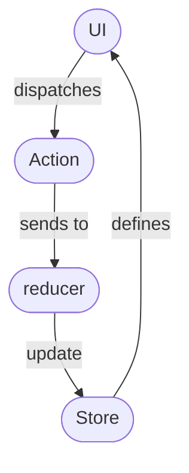

While I've extensive experience in using Redux for React Apps with JavaScript, I've never used this setup for a TypeScript App so far. Therefore, because of my perspective, I might focus on the technical difficulties around TypeScript and typization. But I'll try to explain the underlying ideas of Redux as well.

### Motivation for using Redux

What I'll do later on in this article, is creating two components which interact with each other. In my case, it will be a [Kanban Board](https://en.wikipedia.org/wiki/Kanban_board) app with three columns, together with a component that submits new tasks when the user hits the submit button. On the Kanban Board itself, the user can move the Tasks for the three columns or also delete them as soon as the user completed them.

We could easily implement this simple example without redux: you can just place both components into a parent component. This parent components has a state containing an array of the items. Now you can pass callback functions to both the input component and the item list, which allows for creation and deletion of items. While this works for a small project, the problem arises when the structure of the project grows, having multiple components interacting with each other and with multiple levels of nesting in each other. Passing down everything using props and callbacks is then no longer an option, or at least, the project structure becomes messy.

With Redux, we can decouple these components in the way that the components interact with one global state library. There are three fundamental objects, being important for a Redux architecture:

- Store

- Actions

- Reducer(s)

The Store saves the global state for the app. The components of the store can subscribe to a (subset) of the store’s data, in a way that they can consume the data and that a change of the data in the store triggers a re-rendering of the component.

The UI components are submitting actions to propose an update for the store. Redux actions usually carry an object, specifying its type and carrying a payload, which we attach to this action. Recalling my motivation for implementing the item list, we would need two types of actions: `create_item` and `delete_item`. Here the `create_item` action, would carry a string as payload, contributing the items description, while the `delete_item` action would carry an id of the item which we want to delete.

The Reducer is a pure function, which receives the dispatched action as input, together with the old store and returns the new store as output. Pure means that it doesn't include any side effects, so that the same old store together with the same dispatched action will always produce the same new store, independent of any other circumstances (different times, different external data sources...).



### Creating a React TypeScript App and configuring Redux

I start with a fresh TypeScript app, created with create-react-app:

```
create-react-app kanban-board --template typescript
```

Next, we install redux:

```
cd redux-immer
yarn add react-redux
yarn add -D @types/react-redux
```

Within the source directory, we create a new file `common.ts`.

In a complex application, we would usually have several reducers for different purposes, which we all combine into one root reducer. Within the `store` folder we create a folder for the redux part of our itemList, `/src/store/itemList`. Then we define our action types in `/src/store/itemList/actionTypes.ts`:

```javascript
// /src/common.ts:

enum TaskStatus {
    ToDo = "TO DO",
    Doing = "DOING",
    Done = "DONE"
}

enum TaskActions {
  Create = "CREATE",
  SetStatus = "SET_STATUS",
  Delete = "DELETE"
}

export {TaskStatus, TaskActions}
```

Next we define our types in a new file `type.d.ts`:

```javascript
interface IItem {
    id: number
    title: string
  }

type ItemsState = {
    items: IItem[]
  }

type ItemAction = {
  type: string
  item: IItem
}

type DispatchType = (args: ItemAction) => ItemAction
```

Here the `ItemsState` defines the structure of the Redux store, or at least that part of the store that relates to the ItemList. The `ItemAction` carries two properties, the type of the action, together with the affected Item.

Now, our components can call Action Creators, which are creating actions that thy can dispatch to the store to create or remove items from the list:

```javascript
// /src/store/taskList/actionCreators.ts:

import * as actionTypes from './actionTypes';
import { TaskActions, TaskStatus } from '../../common';

export function addTask(taskTitle: string): TaskAction {
  const action = {
    type: TaskActions.Create,
    payload: { taskTitle },
  };

  return action;
}

export function updateTask(taskId: Number, status: TaskStatus): TaskAction {
  console.log('updateTaskCreator ');
  const action: TaskAction = {
    type: TaskActions.SetStatus,
    payload: { status, taskId },
  };
  return action;
}

export function removeTask(taskId: Number): TaskAction {
  const action: TaskAction = {
    type: TaskActions.Delete,
    payload: { taskId },
  };

  return action;
}
```

Next we can define in our reducer, which way it should react to our actions and how the Redux store should change regarding them:

```javascript
// /src/store/taskList/reducer.ts

import { TaskStatus, TaskActions } from '../../common';

const initialState: TasksState = {
  tasks: [
    {
      id: 1,
      title: 'item 1',
      status: TaskStatus.ToDo,
    },
    {
      id: 2,
      title: 'item 2',
      status: TaskStatus.Doing,
    },
    {
      id: 3,
      title: 'item 3',
      status: TaskStatus.Done,
    },
  ],
};

const itemListReducer = (state: TasksState = initialState, action: TaskAction): TasksState => {
  console.log('reducer!', state, action);

  switch (action.type) {
    case TaskActions.Create:
      const newItem: ITask = {
        id: Math.random(),
        title: action.payload.taskTitle,
        status: TaskStatus.ToDo,
      };

      return {
        ...state,
        tasks: state.tasks.concat(newItem),
      };

    case TaskActions.SetStatus:
      const { taskId, status } = action.payload;
      const updatedTasks: ITask[] = state.tasks.map(task =>
        task.id === taskId ? { ...task, status } : task,
      );

      return {
        ...state,
        tasks: updatedTasks,
      };

    case TaskActions.Delete:
      const newTasks: ITask[] = state.tasks.filter(item => item.id !== action.payload.taskId);

      return {
        ...state,
        tasks: newTasks,
      };
  }

  return state;
};

export default itemListReducer;
```

Now, we can define our redux store in `/src/store.ts`:

```javascript
// /src/store.ts:
import { combineReducers, createStore } from 'redux';
import itemListReducer from './taskList/reducer';

const store = createStore<IRootState, any, any, any>(
    combineReducers({
        tasks: itemListReducer
}));

export default store;

```

And finally provide our App with the created redux store in `App.js`:

```javascript
import React from 'react';
import './App.css';
import { Provider } from 'react-redux';
import store from './store/store';

function App() {
  return (
    <Provider store={store}>
      <div className="App">
        <header>ItemList App</header>
      </div>
    </Provider>
  );
}
```

### Subscribing and dispatching to the redux store

### The final App

Since I want to focus here on the Redux setup in TypeScript, I will skip the other details about the. I published it on [https://github.com/achimcc/kanban-naive](https://github.com/achimcc/kanban-naive) and you can test it here: []
