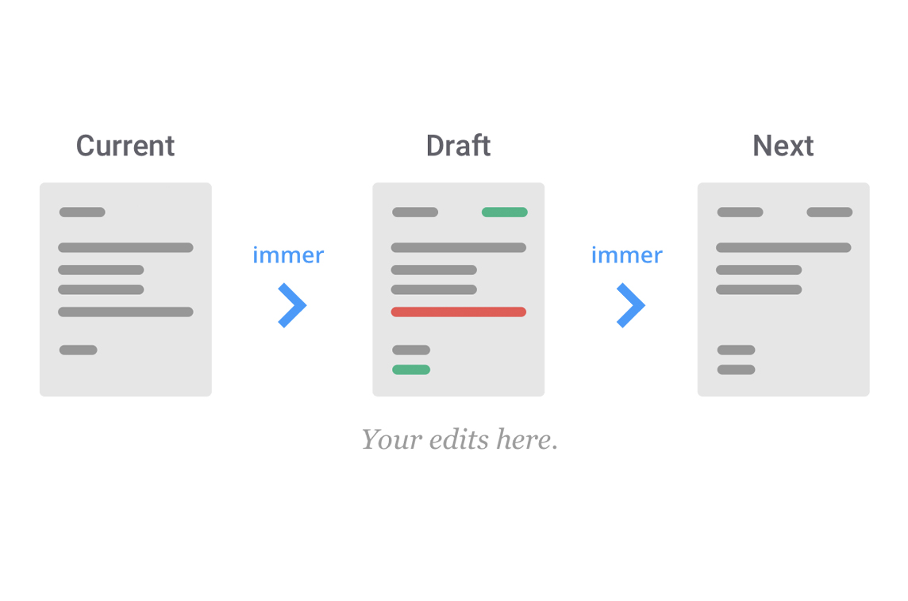

I continue with the App which I created in my last post. I discuss different techniques that improve the structure of the React/Redux/TypeScript Architecture.

### State Normalization

This was the code of our reducer in the previous task:

```javascript
// /src/store/reducer.ts
...
const initialState: TasksState = {
  tasks: [
    {
      id: 1,
      title: "item 1",
      status: TaskStatus.ToDo,
    },
    {
      id: 2,
      title: "item 2",
      status: TaskStatus.Doing,
    },
    {
      id: 3,
      title: "item 3",
      status: TaskStatus.Done,
    },
  ],
};
...
```

and how the reducers act on this state for a change of one task’s status:

```javascript
// /src/store/taskList/reducer.ts

import { TaskStatus, TaskActions } from "../../common";
...
const itemListReducer = (
  state: TasksState = initialState,
  action: TaskAction
): TasksState => {
  switch (action.type) {
...
    case TaskActions.SetStatus:
      const { taskId, status } = action.payload;
      const updatedTasks: ITask[] = state.tasks.map((task) =>
        task.id === taskId ? { ...task, status } : task
      );
      return {
        ...state,
        tasks: updatedTasks,
      };
...
};

export default itemListReducer;
```

The reducer receives the store from redux and it duplicates the complete store which contains all the task data, every time one task status changes. This is necessary, since the previous state is an object whose reference we pass into the reducer and which the reducer may not change (otherwise this might break the component's lifecycle methods like shouldComponentUpdate/useEffect). Now, cloning the complete data every time that we just change one task’s status is a quite costly operation. This becomes more problematic, when the tasks carry additional data in future implementations of the Kanban/Board, like a detailed description, a task list and that like. And since the entire state gets rebuild on every status update, we will also cause a lot of unnecessary re-rendering of the whole application. Hence, it makes sense to separate the information about one task’s status from the remaining task data. I do this by following a method called State Normalization technique, which is [suggested by Redux itself](https://redux.js.org/recipes/structuring-reducers/normalizing-state-shape):

#### Refactoring the Redux Store

I break up the store into two sub-stores:

```javascript
const store = {
  data: {
    tasks: {
      byIds: {
        1: {
          title: 'item 1',
        },
        2: {
          title: 'item 2',
        },
        3: {
          title: 'item 3',
        },
      },
      allIds: [1, 2, 3],
    },
  },
  ui: {
    status: {
      [TaskStatus.ToDo]: [1],
      [TaskStatus.Doing]: [2],
      [TaskStatus.Done]: [3],
    },
  },
};
```

Here, since the status information is relevant for the ui to locate the corresponding tasks within the status columns, we label the redux store section containing the status with 'ui'.

#### Refactoring the Reducers

I set two different sub-reducers for the corresponding sub-states, which I combine by using [combineReducers](https://redux.js.org/api/combinereducers). Since the status updates will be the most dispatched actions, it makes sense to separate the status data from the remaining state. So that the complete store ends up into this structure:

I create two sub-folders in `/src/store` to implement this, namely `tasks` and `ui` and define the corresponding reducers there:

```javascript
// /src/store/tasks/tasksReducer.ts

import { TaskActions } from '../../common';
const initialState: TasksState = {
  tasks: {
    byIds: {
      1: {
        title: 'item 1',
      },
      2: {
        title: 'item 2',
      },
      3: {
        title: 'item 3',
      },
    },
    allIds: [1, 2, 3],
  },
};

const tasksReducer = (state: TasksState = initialState, action: TaskAction): TasksState => {
  switch (action.type) {
    case TaskActions.Create: {
      const { taskTitle, id } = action.payload;
      const newTasks = { ...state.tasks.byIds, [id]: { title: taskTitle } };
      const newIds = state.tasks.allIds.concat(id);
      return {
        ...state,
        tasks: { byIds: newTasks, allIds: newIds },
      };
    }

    case TaskActions.Delete:
      const { taskId } = action.payload;
      const newTasks = { ...state.tasks.byIds };
      const newIds = state.tasks.allIds.filter(id => id !== taskId);
      delete newTasks[taskId];
      return {
        ...state,
        tasks: { byIds: newTasks, allIds: newIds },
      };
  }
  return state;
};

export default tasksReducer;
```

and:

```javascript
// /src/store/ui/uiReducer.ts

import { TaskStatus, TaskActions } from '../../common';
const initialState: UIState = {
  status: {
    [TaskStatus.ToDo]: [1],
    [TaskStatus.Doing]: [2],
    [TaskStatus.Done]: [3],
  },
};

interface IStatus {
  [TaskStatus.ToDo]: Array<number>;
  [TaskStatus.Doing]: Array<number>;
  [TaskStatus.Done]: Array<number>;
}

const uiReducer = (state: UIState = initialState, action: TaskAction): UIState => {
  switch (action.type) {
    case TaskActions.Create: {
      const { id } = action.payload;
      const newStatus = {
        ...state.status,
        [TaskStatus.ToDo]: state.status[TaskStatus.ToDo].concat(id),
      };

      return {
        ...state,
        status: newStatus,
      };
    }

    case TaskActions.SetStatus: {
      const { status, taskId } = action.payload;
      const newStatus = { ...state.status };
      Object.values(TaskStatus).reduce <
        IStatus >
        ((acc: IStatus, value: TaskStatus) => {
          if (status !== value)
            acc[value] = state.status[value].filter((id: number) => id !== taskId);
          else acc[value] = state.status[value].concat(taskId);
          return acc;
        },
        newStatus);

      return {
        ...state,
        status: newStatus,
      };
    }

    case TaskActions.Delete:
      const { taskId } = action.payload;
      const newStatus = { ...state.status };
      Object.values(TaskStatus).forEach(
        status => (newStatus[status] = newStatus[status].filter((id: number) => id !== taskId)),
      );

      return {
        ...state,
        status: newStatus,
      };
  }
  return state;
};
export default uiReducer;
```

so we can combine the reducers with `combineReducer` in `store.ts`:

```javascript
import { combineReducers, createStore } from "redux";
import tasksReducer from "./tasks/tasksReducer";
import uiReducer from "./ui/uiReducer";

const store = createStore<IRootState, any, any, any>(
  combineReducers({
    data: tasksReducer,
    ui: uiReducer,
  })
);

export default store;
```

with the corresponding type definitions in `type.d.ts`:

```javascript
interface ITask {
  id: number;
  title: string;
  status: TaskStatus;
}

interface IRootState {
  data: TasksState;
  ui: UISTate;
}
interface ITaskStatus {
  TaskStatus: string;
}

type TasksState = {
  tasks: {
    byIds: Object<any>,
    allIds: Array<number>,
  },
};
type UIState = {
  status: Object<any>,
};

type TaskAction = {
  type: TaskActions,
  payload: any,
};

type DispatchType = (args: TaskAction) => TaskAction;
```

When an action trigger's a status change, this will no longer affect the whole application state. We avoid unnecessary re-rendering and frequent duplication of enormous data sets.

#### Selector for useSelector Hook

By transforming the structure of the Redux Store we optimized it in terms of performance and unnecessary re-rendering. But our components are still requiring the same data structure as before. The callback function which gets passed to the `useSelector` hook composes the required data from the store. This composition is now more complicated and since we might require the same data structure in different parts of the app, I move this function, the selector, to a separate file `selectors.tsx` in the `/src/store` folder.

Since our selection of tasks which we require for our `TaskList` component depends on the tasks `type`, I define the selector as a higher-order function: it receives the type as an argument and returns the matching selector function, which is extracting the tasks of the required status from the store:

```typescript
import { TaskStatus } from '../common';

const taskSelector = (status: TaskStatus) => (store: IRootState) =>
  store.ui.status[status].map((id: number) => ({
    id,
    status: status,
    ...store.data.tasks.byIds[id],
  }));
export { taskSelector };
```

Which we can import, wherever we need it. For the current project, this is in `TaskList.tsx`:

```typescript
...
import { useSelector } from "react-redux";
import { taskSelector } from "../../store/selectors";

...

const TaskList = ({ status, title }: Props) => {
  const classes = useStyles();
  const tasks = useSelector((store: IRootState) => taskSelector
...
}

export default TaskList
```

However, the reducer actions are complex, since we still to duplicate the sub-store when executing an action in the corresponding sub-reducer. You can review the code of all files in the [normalized](https://github.com/achimcc/kanban-board/tree/normalized) branch of the kanban-board GitHub repo.

In the next section, I explain how we can simplify this process:

### How to simplify the Reducer with Immer.js

[Immer.js](https://github.com/immerjs/immer) is a library which simplifies the work with immutable data structures. The easiest way to update the Redux store would be by simply operating on it by adding/deleting keys band pushing values to arrays. As discussed above, React does not allow this, the reducer needs to be a pure function, receiving the old store as input together with our action and returning the new store without modifying the old one. Now, with Immer.js we can mimic operating on the original state: Immer.js provide the method `produce` which receives the old redux store as an argument, together with a callback function which operates on some `draft` state. I record the operations on the draft state as changes to the old redux store and finally `produce` creates an updated store out of the original stores and the "change requests" recorded in the draft state:



_The way Immer.js works when updating the redux store or any other object without modifying the original object._

I begin by adding Immer.js to the projects source directory:

```
yarn add immer
```

Now, by invoking `produce` from Immer.js, we get a much cleaner reducer structure, compared to the reducers above:

```javascript
// /src/store/tasks/taskReducer.ts:

import { TaskActions } from '../../common';

import { produce } from 'immer';

const initialState: TasksState = {
  tasks: {
    byIds: {
      1: {
        title: 'item 1',
      },
      2: {
        title: 'item 2',
      },
      3: {
        title: 'item 3',
      },
    },
    allIds: [1, 2, 3],
  },
};

const tasksReducer = (state: TasksState = initialState, action: TaskAction): TasksState =>
  produce(state, (draft: TasksState) => {
    switch (action.type) {
      case TaskActions.Create: {
        const { taskTitle, id } = action.payload;
        draft.tasks.byIds[id] = { id, title: taskTitle };
        draft.tasks.allIds.push(id);
        break;
      }

      case TaskActions.Delete:
        const { taskId } = action.payload;
        delete draft.tasks.byIds[taskId];
        draft.tasks.allIds = draft.tasks.allIds.filter(id => id !== taskId);
        break;
    }
  });

export default tasksReducer;
```

and:

```javascript
// /src/store/uiReducer.ts:

import { TaskStatus, TaskActions } from '../../common';
import { produce } from 'immer';

const initialState: UIState = {
  taskStatus: {
    [TaskStatus.ToDo]: [1],
    [TaskStatus.Doing]: [2],
    [TaskStatus.Done]: [3],
  },
};

const uiReducer = (state: UIState = initialState, action: TaskAction): UIState =>
  produce(state, (draft: UIState) => {
    switch (action.type) {
      case TaskActions.Create: {
        const { id } = action.payload;
        draft.taskStatus[TaskStatus.ToDo].push(id);
        break;
      }

      case TaskActions.SetStatus: {
        const { status: taskStatus, taskId } = action.payload;

        Object.values(TaskStatus).forEach(status => {
          if (taskStatus === status) draft.taskStatus[status].push(taskId);
          else
            draft.taskStatus[status] = draft.taskStatus[status].filter(
              (id: number) => id !== taskId,
            );
        });

        break;
      }

      case TaskActions.Delete: {
        const { taskId } = action.payload;

        Object.values(TaskStatus).forEach(
          status =>
            (draft.taskStatus[status] = draft.taskStatus[status].filter(
              (id: number) => id !== taskId,
            )),
        );
        break;
      }
    }
  });

export default uiReducer;
```

That's it. The state normalization optimized the Redux Store in terms of performance and introducing `immer` drastically simplified the reducer structure. The code of all files is available in the [immer](https://github.com/achimcc/kanban-board/tree/immer) branch of the kanban-board GitHub repo.
