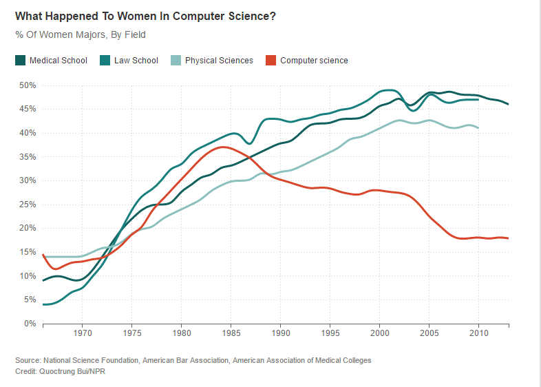

I studied Mathematics and Physics and I worked the last 4 years in different roles in the IT industry. The huge dis-balance in the rate of male vs. female employees or researchers in math and tech is an undeniable fact. Fewer women than men study math or IT subjects and even less end up in a technical role in the IT industry.

I remember myself being the being a kid that always experienced natural attraction and fascination for electronic devices and applications. I’m aware of photographs taken from me, being three years old, wiring a battery to a bulb. Or being 6-year-old and programming an Atari ST with Logo. I’ve always been the guy they asked to program the neighbor’s video recorder.

I find it difficult to say if I stuck to IT and electronics because my parents provided the right toys to me. Or if they provided them to me because they realized that they caught my attention with them. But there is a difference in the response and treatment of society to children interfering with technology regarding their gender.

And there is a strong dominance of male persons in the tech industry. Very often they are stabilizing and defending it. For example, by denying female employees the technical expertise to understand or solve a certain technical problem.

For me, it becomes more clear that this dis-balance, the `Gender Gap`, results from structural problems in our society, from role models and from the behavior of white men defending their supremacy in the sector when I look for example at the historical evolution of the percentage of women in computer science:

_Taken from [here](https://jaxenter.com/women-in-computer-science-majors-133646.html)_

As a developer, I would like to improve in acting and responding in the right way to those circumstances. If you are aware of local groups or initiatives dealing with this specific issue here in Berlin, please get in touch with [me](mailto:codingconnects@posteo.de). Building awareness of the existing problems and examining their roots is what I believe is the first step to address this problem. I discovered this movie as an interesting contribution to this topic:

`youtube:https://www.youtube.com/embed/8VVb6M8pTvE`
_CODE: Debugging the Gender Gap (Trailer)_

I stumbled over it, while I was exploring the online services from Berlin public libraries. It discusses multiple reasons for the gender gap and gives voice to several women who successfully made their way into tech-industry. Just for the case that you are living in Berlin, it’s worth paying the 10 Eur annual fee to gain access to it [here](https://voebb.ava.watch/film/code-debugging-the-gender-gap/).
