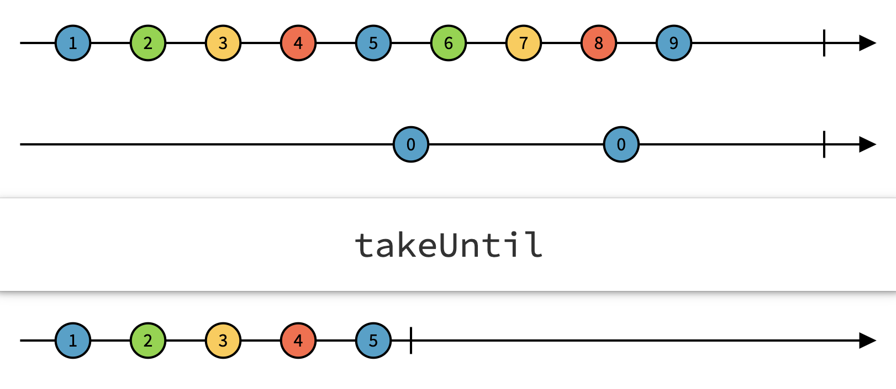
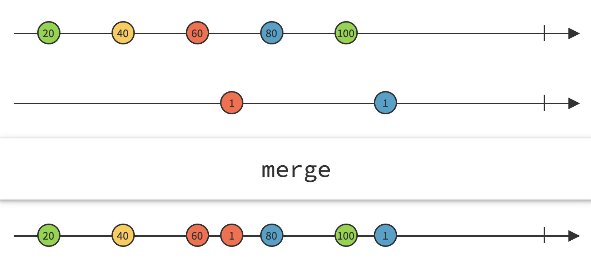
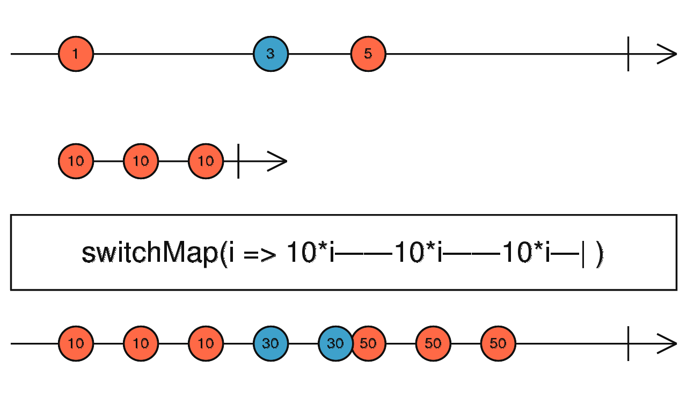

Say, you want an autosuggest feature for an app in which you ask the user to enter his or her street name in an address form: if the user is typing text into an input field; you provide an `onChange` event handler, which is a callback. This callback function requests a list of suggestions from some api.

Together with the fetch request, you pass another callback. This other callback provides the suggestions, once the fetch resolves. And what happens when the user types fast, is that you have concurrent events and the first fetch can resolve after the second.

What I’m describing here is a pull-based architecture. And this is what is often used, when someone is dealing with asynchronous events in JavaScript. An improvement of this architecture is the introduction of promises. They help to avoid what we call callback-hell.

But with promises, you won’t gain a proper control of concurrent asynchronous events. What takes us a step forward is [RxJs](https://rxjs-dev.firebaseapp.com/):

#### RxJs to handle aynchronous events

I found a pleasant introduction to the topic. I watched it first and I enjoyed it for highlighting the underlying [duality](<https://en.wikipedia.org/wiki/Duality_(mathematics)>) pattern between pull- and push-based architectures:

`youtube:https://www.youtube.com/embed/dDAtp9mfZWE`
_RxJs - Explained by the Creator Erik Mayer_

Learning a new technology, I want to get my hands on it as fast as possible. What I found a good application for it, is a drag-and-drop app. I’m aware of existing libraries that do an excellent job for this, like React-dnd. But If I write one by myself it helps me to understand the underlying mechanisms of RxJs and it probably enables me to do real basic modifications of the drag-and-drop behavior, which I then adjust to my use case.

I remember that I once did a POC use case where I was training a neural network with the users’ screen interaction to gain a better understanding of his experience level in using the web app. So we could provide him a better experience by switching from basic to expert mode or providing some additional hints. I feel that this is just a perfect use-case since it involves capturing the mouse-movements and syncing it with some other processes or api’s. I’ll keep this in mind for the future ;).

There are also drag-and-drop by RxJs examples elsewhere on the [web](https://medium.com/better-programming/drag-and-drop-made-easy-with-rxjs-8cd4a8994a07), but I found them a way to simple, and not very well implemented.

#### Getting started with an RxJs App

I create a new TypeScript app with `create-react-app`:

```
create-react-app rxjs-dnd --template typescript
cd rxjs-dnd
```

Then I add rxjs to the project:

```
yarn add rxjs
```

I want to keep this project as simple as possible, but using [immer](https://github.com/immerjs/immer) is always a good idea, even for simple state management without redux. And I use [styled components](https://styled-components.com/), since I want to highlight the item I’m dragging:

```
yarn add immer
yarn add styled-components
```

I want to have ten items and two zones, so we can drag and drop the items from one zone to the other. This is the working example of the small drag-and-drop App I want to describe here. Just try it here (its interactive):

<iframe src='https://vigorous-goldwasser-b66350.netlify.app/' style={{width: '100%', height: '400px'}} />

Or follow the external [link](https://vigorous-goldwasser-b66350.netlify.app/).
This is the code for my App, except for the Item component, in which the RxJs magic is happening:

```typescript{numberLines:0}
// App.tsx:
import React, { useEffect, useState } from 'react';
import './App.css';
import styled from 'styled-components';
import { produce, enableMapSet } from 'immer';
import Item from './Item';

const Container = styled.div`
  display: grid;
  grid-template-columns: 1fr 1fr;
  grid-column-gap: 50px;
  margin: 5vw;
`;

const DropZone = styled.div`
  border: 1px solid black;
  width: 100%;
  min-height: 40vw;
`;

const items: Record<number, Item> = [...new Array(10)]
  .map((el, ind) => ind)
  .reduce((acc: Record<number, Item>, cur: number) => {
    acc[cur] = { title: `Item ${cur}` };
    return acc;
  }, {});

function App() {
  useEffect(() => {
    enableMapSet();
  }, []);
  const [zones, setZones] = useState({
    zone1: new Set<number>([...new Array<number>(10)]
                                   .map((el, ind) => ind)),
    zone2: new Set<number>(),
  });

  const moveToZone = (idToSet: number, toZone: dropZone) => {
    setZones(zones =>
      produce(zones, draft => {
        Object.keys(zones).forEach(zone => {
          if (zone === toZone) draft[zone].add(idToSet);
          else draft[zone as dropZone].delete(idToSet);
        });
      }),
    );
  };

  return (
    <div className="App">
      <Container>
        {Object.keys(zones).map(zone => (
          <DropZone key={`${zone}`} id={`${zone}`}>
            <div>{zone}</div>
            {[...zones[zone as dropZone]].map((id: number) => (
              <Item
                item={items[id]}
                id={id}
                moveToZone={moveToZone}
                key={id}
              />
            ))}
          </DropZone>
        ))}
      </Container>
    </div>
  );
}

export default App;
```

I create two div’s, the `DropZone`’s, 5 items which I separate by their Id’s and in line 36 I define a function which allows me to send the `Item`’s to one of the `DropZone`’s.

The interesting part of the App is the code of the `Item` component:

```typescript{numberLines:0}
import { useEffect, useRef, useState } from "react";
import { map, switchMap, take, takeUntil } from "rxjs/operators";
import { fromEvent, merge } from "rxjs";
import styled from "styled-components";

interface Props {
  id: number;
  item: Item;
  moveToZone: Function;
}

type Pos = {
  x: number;
  y: number;
};

const ItemDiv = styled.div<{ isDragging: Boolean; pos: Pos }>`
  border: 1px solid black;
  border-radius: 10px/50%;
  margin: 5px;
  padding: 10px;
  box-sizing: border-box;
  background: ${(props) => (props.isDragging ? "yellow" : "white")};
  transform: translate(${(props) => `${props.pos.x}px, ${props.pos.y}`}px);
`;

const Item = ({ item, id, moveToZone }: Props) => {
  const [isDragging, setIsDragging] = useState(false);
  const [pos, setPos] = useState<Pos>({ x: 0, y: 0 });
  const itemRef = useRef<HTMLDivElement>(null);
  useEffect(() => {
    const mousedown$ = fromEvent<MouseEvent>(
      itemRef.current as HTMLDivElement,
      "mousedown"
    );
    const mousemove$ = fromEvent<MouseEvent>(document, "mousemove");
    const mouseup$ = fromEvent<MouseEvent>(document, "mouseup");
    const drag$ = mousedown$.pipe(
      switchMap((start) => {
        return merge(
          mousemove$.pipe(
            map((move) => {
              move.preventDefault();
              return {
                type: "move",
                x: move.x - start.x,
                y: move.y - start.y,
              };
            }),
            takeUntil(mouseup$)
          ),
          mouseup$.pipe(
            map((endPos) => {
              return {
                type: "end",
                x: endPos.clientX,
                y: endPos.clientY,
              };
            }),
            take(1)
          )
        );
      })
    );

    const subscription = drag$.subscribe((evt) => {
      switch (evt.type) {
        case "move":
          setIsDragging(true);
          setPos((pos) => ({ x: evt.x, y: evt.y }));
          break;
        case "end":
          setIsDragging(false);
          const path = document
            .elementsFromPoint(evt.x, evt.y)
            .map((el) => el && el.id);
          const zones = ["zone1", "zone2"];
          const zoneToDrop = zones.find((zone) => path.includes(zone));
          if (zoneToDrop) {
            moveToZone(id, zoneToDrop);
          }
          setPos({ x: 0, y: 0 });
      }
    });
    return () => subscription.unsubscribe();
  }, [id, moveToZone]);

  return (
    <ItemDiv ref={itemRef} isDragging={isDragging} pos={pos} id={`item${id}`}>
      {item.title}
    </ItemDiv>
  );
};

export default Item;
```

I use RxJs here within the `useEffect` hook. I declare in line 37-42 three observables: `mousedown$`, `mousemove$` and `mouseup$`. Once I’ve declared an observable, I subscribe to it and tell the app how it should react to events which the observables are submitting.

#### Marbles

Observables are emitting a stream of events. We visualize this stream on a time axis, on which we place marbles. Then every single marble is representing an event. Now, with Operators, we can transform and manipulate those streams of events.

Talking of Operators, it is important to know that we have two distinct types of operators: Creation Operators and Pipeable Operators. Creation Operators are creating Observables out of a data source. I already used them when I defined `mousedown$`, `mousemove$` and `mouseup$`. In this case, I create Observables out of the mouse interactions on Dom Elements. Pipeable Operators are Operators which receive one Observable and return a new Observable. Starting with an observable, let’s say `observable$` and two Pipeable Operators, `Op1` and `Op2`, we can apply both of them to `observable$`, by writing: `Op1(Op2(observable$))`.

Since this is getting unreadable quickly, the RxJs way to write this is:

```typescript
observable$.pipe(Op1, Op2);
```

#### Construction of the drag$ Operator

Let’s look at the `drag$` Observable in line 37 and how I create it out of other Observables and Operators:
I construct `drag$` out of three observables: `mousedown$`, `mousemove$` and `mouseup$`. Let me explain the construction of the `drag$` Observable from the inner Observables to the outer ones:

I send `mousemove$` into a pipe, where each `mousemove$` event is mapped to an object which will be emitted by the resulting Observable. Then, the Observable is asked to terminate it’s stream when the ‘mouseup$‘ event occurs, which is done by applying the `takeUntil` Operator:


_Visual representation of the takeUntil operator, which merges the stream of two events into a new stream_

- `mouseup$` works similar to `mousemove$`, just that it returns an object with a different type value, ‘end‘, and with the operator `take(1)` which ends the stream after the first Submission. When want to drag-and-drop objects, and the drag-and-drop ends with the first `mouseup$` event.

* `merge` The `merge` operator unites my two Observables into one:


_Visual representation of the merge operator, which merges the stream of two events into a new stream_

- `switchMap` receives the `mousdown$` subscription: in therms of causality, this is the first event which is happening in the chain: Switchmap takes the newest `mousedown$` event on the Item and returns the Stream of Observables which results from the `merge` Operator and which depends on the initial event (in this case on the coordinates of the initial `mousedown$` event). Whenever the subscribed observable, `mousedown$`, is emitting a new event, the current stream of events gets thrown away and is being replaced by a new one:


_Visual representation of the switchMap Operator._

#### Subscribing to the drag$ Operator

After I declared the `drag$` Observable I just need to subscribe to it, process the emitted events and update the item's position: as long as the emitted event is `move`, I set the new screen position. On the `end` event, I use DOM methods to find the Dropzone in which the mouse pointer is located, send the item to the captured drop zone and reset it's position.

You can find the full code in this Github [repo](https://github.com/achimcc/rxjs-dnd).
