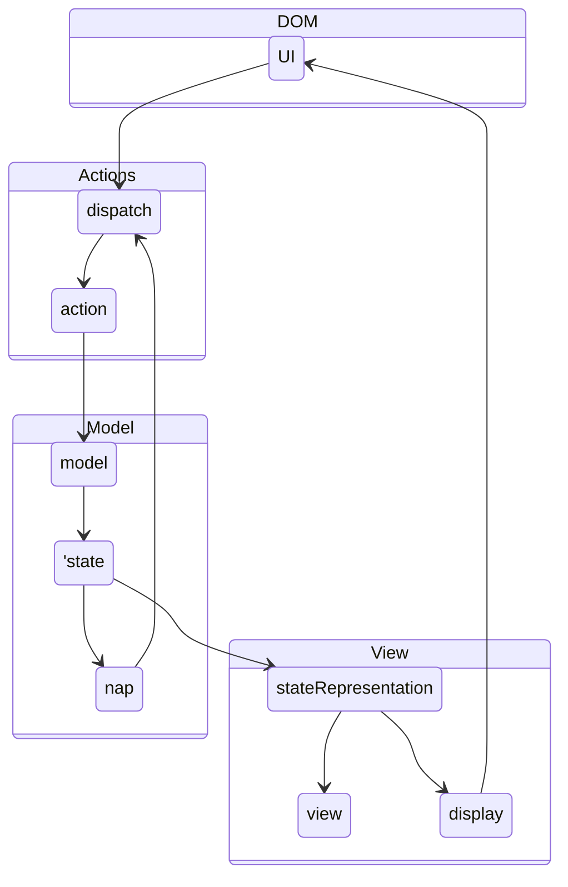

# The SAM Pattern

I discuss here an architecture model which is an alternative to more common models like Redux or MVC. It is the [SAM Pattern](http://sam.js.org/), which goes back to [Jean-Jacques Dubray](https://github.com/jdubray) and his blog post [Why I No Longer Use MVC Frameworks](https://www.infoq.com/articles/no-more-mvc-frameworks/). It is also presented and explained in the last chapter of the book [Front-End Reactive Architectures](https://www.springer.com/de/book/9781484231791).
My interested in this model originates from the search for clean seperation of the business logic from the view. In Redux for example, you can palce some business logic intio the reducer. Indeed, it is recmmended in the redux style guid to place [Put as Much Logic as Possible in Reducers](https://redux.js.org/style-guide/style-guide#put-as-much-logic-as-possible-in-reducers). But in many cases this is not possible, since the reducer is a pure function which receives the old Redux and the action and computes the new store out of it. Hence, calling an API or any other sort of asynchronous processing can not be handled by the reducer. 

I'm convinced that the frotend components are certainly the wrong place to store business logic which is handling asynchronous events and the reducers are not capable of it. Usually a Redux [Middleware](https://redux.js.org/tutorials/fundamentals/part-4-store#middleware) like [Redux Observables](https://redux-observable.js.org/), [Redux Thunks](https://github.com/reduxjs/redux-thunk), [Redux Saga](https://github.com/reduxjs/redux-thunk) or [Redux Logic](https://github.com/jeffbski/redux-logic) is introduced to handle this. But this approach is using a heavy machinery, introduces a high level of complexity and depending on the choice of the middleware it might still lack some of my desired features like:

* Validate an action depending on its payload, the current store and possible side-effects before it reaches the store, and odify it or prevent it from reaching the store.
* Process aynchronous events after the action has reached the store, depending on the new store value.
* Dispatch other action from within the Redux Middleware.

All of my desired features can be implemented follwoing the SAM pattern. And this can even be done by using pure JavaScript or TypeScript, zou don't even need to use React. I still continue to use React with this approach, due to its virtual DOM and also due to its wide distribution with a lot of useful components being available.

# The reactive loop in the SAM pattern

An app following the SAM pattern archtiecture has a *view* which is computed out of the *model*. The *model* is toring the apps data state. Compared to redux, the data is stored in mutable object which is part of the state. That is probably the most confusing part of the SAM pattern for me, and appears to be a drawback, compared to a Redux architecture.

The way in which the interaction and re-rendering of the App happens is the reactive loop. It sumamrizes in the following steps:

1. A user interaction in the *UI* triggers the dispatch of an *action*, passing an *intent* to it.
2. The *action* is a function which processes this *intent*, during which it is able to perform asynchronous computations. Finally it is presenting a *proposal* to the *present* function, which is part of the *model*.
3. The *present* function of the model is processing the *proposal* and is either accepting or rejecting it. The *state* is involved in this procedure. While the state in Redux is the place which keeps the data, the *state* in the SAM pattern is an object containing pure functions, which depends on the models data, as well as on the data submitted by the proposal. While the model stores the values of the app and evaluates the actions, the state defines the semantics, under which the actions are processed.
4. In the case that the model's data has been updated, the *process* function of the model calls the *render* function, which is a part of the *state* object. The render function consists of two distinct function calls:
  * *stateRepresentation*
  * *nap*
5. *stateRepresentation* receives the *model*'ss data and computes the next *view*. Then it renders this *view*, by calling the *display* function.
6. The *nap* function (=next action predicate) uses the *model*'s data and possibly the *state* semantics, to determnie if another action should be performed. If this is the case, it triggers the dispatch of another *action*.

_The reactive loop in the SAM pattern_

Usually a user inter

    /*
    
    state --> stateRepresentation
    nap --> dispatch
    stateRepresentation --> view
    stateRepresentation --> display
    display --> UI
    */
