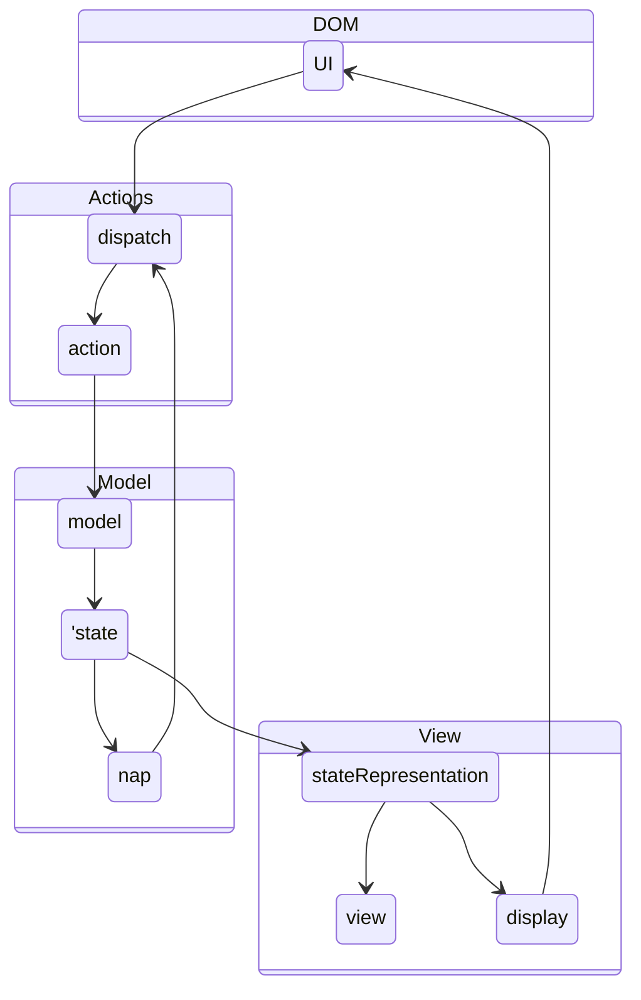

I discuss here an architecture model which is an alternative to more common models like Redux or MVC. It goes back to [
Jean-Jacques Dubray](https://github.com/jdubray) and his blog post [Why I No Longer Use MVC Frameworks](https://www.infoq.com/articles/no-more-mvc-frameworks/). It is also presented and explained in the last chapter of the book [Front-End Reactive Architectures](https://www.springer.com/de/book/9781484231791).

My interested in this model originates from the search for clean seperation of the business logic from the view. In Redux for example, you can palce some business logic intio the reducer. Indeed, it is recmmended in the redux style guid to place [Put as Much Logic as Possible in Reducers](https://redux.js.org/style-guide/style-guide#put-as-much-logic-as-possible-in-reducers). 

    /*
    
    state --> stateRepresentation
    nap --> dispatch
    stateRepresentation --> view
    stateRepresentation --> display
    display --> UI
    */
