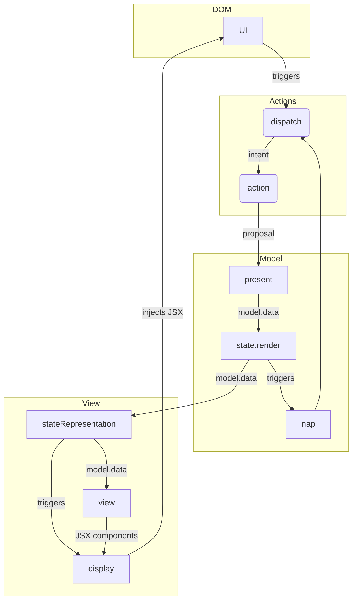

---

layout: post

title: The SAM pattern

author: [Achim]

date: 2021-04-06T08:00:00.169Z

draft: false

permalink: sam-pattern

category: Coding

tags:

- TypeScript

- Architecture

- Reactive Programming

- React

excerpt: The SAM Pattern as an alternative approach to widely adopted Frontend architectures. I show how to implement a simple web game with this pattern.

image: img/marbles.jpg

---

  

# The SAM Pattern

  

The [SAM Pattern](http://sam.js.org/) is an alternative to more well known architecture models like a Redux architecture or [MVC](https://en.wikipedia.org/wiki/Model%E2%80%93view%E2%80%93controller). It goes back to [Jean-Jacques Dubray](https://github.com/jdubray) and his blog post [Why I No Longer Use MVC Frameworks](https://www.infoq.com/articles/no-more-mvc-frameworks/). It is also presented and explained in the last chapter of the book [Front-End Reactive Architectures](https://www.springer.com/de/book/9781484231791).

I discovered this pattern during my search for a frontend architecture which provides a clean separation of the business logic from the view. Cnsidering Redux, you can place some business logic into the reducer. In point of fact, the redux style guide recommends to [place as much logic as possible in reducers](https://redux.js.org/style-guide/style-guide#put-as-much-logic-as-possible-in-reducers). But very often this is not possible, since the reducer is a pure function which receives the old Redux and the action and computes the new store out of it. As a result the reducer can not handle an API or any other sort of asynchronous process.

It is my conviction that fronted components are the wrong place to store complex business logic, which is handling asynchronous events. In addition, the reducers of a Redux store are not capable of it. Commonly a [Redux Middleware](https://redux.js.org/tutorials/fundamentals/part-4-store#middleware) like [Redux Observables](https://redux-observable.js.org/), [Redux Thunks](https://github.com/reduxjs/redux-thunk), [Redux Saga](https://github.com/reduxjs/redux-thunk) or [Redux Logic](https://github.com/jeffbski/redux-logic) is introduced to handle this. But this approach is using a heavy machinery, introduces a high level of complexity and depending on the choice of the middleware it might still lack some of my desired features like:

  

* Validate an action depending on its payload, the current store and side-effects before it reaches the store, and change it or prevent it from reaching the store.

* Process asynchronous events after the actions have reached the store, depending on the new store value.

* Dispatch other action from within the Redux Middleware.

  

All of my desired features can be implemented by applying the SAM pattern. And it can be accomplished using pure JavaScript or TypeScript, we don't even need to use React. However, I continue to use React with this approach, because of its virtual DOM and also due to its wide distribution with a lot of useful components being available.

  

### The reactive loop in the SAM pattern

  

Following the SAM pattern architecture, an app has a `view` which it derives out of the `model`'s data. Compared to redux, the data consists of a mutable object. That is probably the most confusing part of the SAM pattern for me, and appears to be a drawback, compared to a Redux architecture, where we are always dealing with immutable objects.

  

The cycle of interaction and re-rendering of the App is called the reactive loop. It summarizes in the following steps:

  

1. A user interaction in the *UI* triggers the dispatch of an `action`, passing an `intent` to it.

2. The `action` is a function which processes this `intent`, during which it can perform asynchronous computations. Finally, it is presenting a `proposal` to the `present` function, which is part of the `model`.

3. The `present` function of the model is processing the `proposal` and is accepting or rejecting it. It involves the `state` in this procedure. While the state in Redux is the place which keeps the data, the `state` in the SAM pattern is an object containing pure functions, which depends on the models data, and the data submitted by the proposal. While the model stores the values of the app and evaluates the actions, the state defines the semantics, under which the `model` processes the actions.

4. After updating the model's data, the `process` function of the model calls the `render` function, which is a part of the `state` object. The render function comprises two distinct function calls:

1.  `stateRepresentation`

2.  `nap`

5.  `stateRepresentation` receives the `model`'s data and computes the next `view`. Then it renders this `view`, by calling the `display` function.

6. The `nap` function (=next action predicate) uses the `model`'s data and possibly the `state` semantics, to determine if it should perform another action. If this is the case, it triggers the dispatch of another `action`.

  
  
  

_The reactive loop in the SAM pattern_

  

## A sample implementation SAM for a browser game


###  Towers of Hanoi
  

I picked the [Towers of Hanoi](https://en.wikipedia.org/wiki/Tower_of_Hanoi) as a sample application to implement, while following the SAM pattern. To improve its usability, I implement the user interaction with drag and drop. Since I want to focus on implementing the SAM pattern, I use an external library for the drag-and-drop interaction, which is [react-dnd](https://www.npmjs.com/package/react-dnd).

Here is the result of game whcih I implemented using SAM, please try the game by yourself and think about the possible states the app could obtain, as well as about the possible set of actions which could be triggered:

  

<iframe  src='https://blissful-gates-e99ed8.netlify.app/'  style={{width:  '100%',  height:  '400px'}}  />

  

### Implementation following the SAM pattern

  

When you try the Hanoi game above, you realize is the app can be in three fundamentally different states, displaying non-related screen:

  

1. The initial screen.

2. The screen while playing the game.

3. The screen which is shown once the game is solved.

  

Hence the app carries a global state, which allows to assign it to one of those three states:

  

```typescript

type  Status = "INIT" | "PLAYING" | "SOLVED";

```

  

The iterations are:

  

1. On the start screen:

* Change the number of tiles

* Start the game

2. While playing:

* Move a tile from one tower to another tower

* Solve the game

3. When solved:

* Reset the game

  

This reflects the following intent types:

  

```typescript

type  IntentType = "TILES" | "START" | "DROP" | "SOLVE" | "RESET" ;

```

  

Check out the [SAM Hanoi Repo](https://github.com/achimcc/sam-hanoi) on my Github account to access the full source code of the app. While I don't want to explain every detail, I still want to remark on the most crucial parts:

  

While I visualize the reactive loop of the SAM pattern in a flowchart, I follow the naming conventions of the directories and function/parameter names in my code:

  



  #### The model

The model persists the data in a mutable object that is updated by the `model`s render function. Specifically, the typization of `model.data` reads as:

  

```typescript

type  LessThan<N  extends  number | bigint> = intrinsic

  

type  TileId = LessThan<10>;

  

type  Presenter = {

(data: Data): void;

};

  

interface  TowerData {

LEFT: Array<TileId>;

MIDDLE: Array<TileId>;

RIGHT: Array<TileId>;

}

  

interface  Model {

data: {towers: Towers, nrTiles: number, status: Status, count: number};

present: Presenter;

}

```

  

Here the `present` function from the `model` is processing the actions proposal's and updating the models data accordingly:

  

```typescript

import  state  from  "./state";

  

const  defaultTowers = (tiles: number) =>

({

LEFT:  Array.from(Array(tiles).keys()),

MIDDLE: [],

RIGHT: [],

} as  TowerData);

  

const  model: Model = {

data: { towers:  defaultTowers(0), nrTiles:  0, status:  "INIT", count:  0 },

present: (intent: Intent) => {

switch (intent.type) {

case  "INIT": {

model.data.status = "INIT";

state.render(model);

break;

}

case  "TILES": {

if (!state.init(model)) break;

model.data.nrTiles = intent.payload.nrTiles;

break;

}

case  "START": {

if (!state.ready(model)) break;

model.data.towers = defaultTowers(model.data.nrTiles);

model.data.count = 0;

model.data.status = "PLAYING";

state.render(model);

break;

}

case  "DROP": {

const { tower, tileId } = intent.payload;

if (!state.canDrop(model, tileId, tower)) break;

for (var  towerId  in  model.data.towers)

if (model.data.towers[towerId].includes(tileId))

model.data.towers[towerId].shift();

model.data.towers[tower].unshift(tileId);

model.data.count++;

state.render(model);

break;

}

case  "SOLVE": {

if (!state.isSolved(model)) break;

model.data.status = "SOLVED";

state.render(model);

break;

}

default: {

break;

}

}

},

};

  

export  default  model;

```

  
#### The state
Subsequently the `state` defines the semantics of the `model`, it tells the `model'`s present function, how to interpret the data. It is using pure functions which evaluate the `model'`s data:

  

```typescript

import  stateRepresentation  from  "../View/stateRepresentation";

import  nap  from  "./nap";

  

const  state: State = {

init: (model: Model) =>  model.data.status === "INIT",

ready: (model: Model) =>

model.data.status === "INIT" && model.data.nrTiles !== 0,

canDrop: (model: Model, tileId: TileId, tower: TowerType) => {

return  Math.min(...model.data.towers[tower]) > tileId;

},

isSolved: (model: Model) => {

return (

model.data.status === "PLAYING" &&

model.data.towers["RIGHT"].length === model.data.nrTiles

);

},

render: (model: Model) => {

stateRepresentation(model);

nap(model);

},

};

  

export  default  state;

```

  
#### The view as a result of the model

Eventually, the model derives the `stateRepresentation` in a declarative way from its data:

  

```typescript

import  React  from  "react";

import  view  from  "./view";

import  display  from  "./display";

  

const  stateRepresentation = (model: Model) => {

let  representation = <div> Playing</div>;

switch (model.data.status) {

case  "INIT":

representation = view.init();

break;

case  "PLAYING":

representation = view.playing(model);

break;

case  "SOLVED":

representation = view.solved(model);

break;

}

display(representation);

};

  

export  default  stateRepresentation;

```

  

In this step, the `stateRepresentation` implements different views, which represent the different screens of the app:

  

```typescript

import  React  from  "react";

import  Board  from  "../../components/Board/Board";

import  Init  from  "../../components/Init/Init";

import  Solved  from  "../../components/Solved/Solved";

  

const  view = {

playing: (model: Model) => <Board  model={model} />,

solved: (model: Model) => <Solved  model={model} />,

init: () => <Init />,

};

  

export  default  view;

```

  

It contains a `display` function which is injecting the derived representation into the DOM.

  

Next to this, the `render` function executes the `nap` function to check if any other action should be dispatched as a consequence of the updated `model`'s data. In our case, it checks if we solved the game after each move and in this case, it sets the game’s status to 'SOLVED' state:

  
  

```typescript

import  dispatch  from  "../Actions/dispatch";

import  state  from  "./state";

  

const  nap = (model: Model) => {

if (state.isSolved(model)) {

dispatch({ type:  "SOLVE" });

}

};

  

export  default  nap;

```

This closes the reactive loop and finishes this sampel implementation of SAM.

## Concluding remarks

It was my intention to fully understand hiw the SAM pattern works under the hood and for this reason I decided to implement the pattern from scratch in favor of using a framework which implements it, like [Ravioli](https://dev.to/dagatsoin/ravioli-framework-introduction-27pm). 

The current version is cross importing the components and I think in a clean implementation this should be avoided using dependency injection. I leave this for a later iteration of this app and probably for another blog post.
<!--stackedit_data:
eyJoaXN0b3J5IjpbLTE1MjQxMDg1NjYsLTY1NTY4MjExNSwtNj
QzNDAxMTE0LDIxMDQ0NjY3MDksMTc3MjM3MDAzOCwxNDA0NDAz
MjY1XX0=
-->