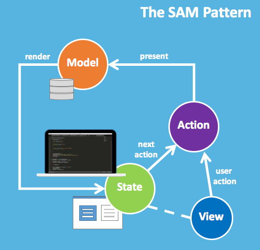
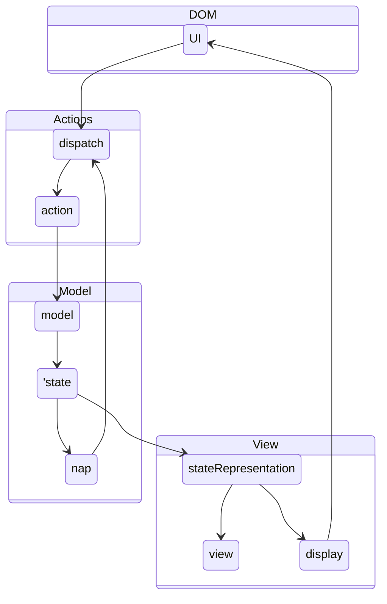

I discuss here an architecture model which is an alternative to more common models like Redux or MVC. It is the [SAM Pattern](http://sam.js.org/), which goes back to [Jean-Jacques Dubray](https://github.com/jdubray) and his blog post [Why I No Longer Use MVC Frameworks](https://www.infoq.com/articles/no-more-mvc-frameworks/). It is also presented and explained in the last chapter of the book [Front-End Reactive Architectures](https://www.springer.com/de/book/9781484231791).

My interested in this model originates from the search for clean seperation of the business logic from the view. In Redux for example, you can palce some business logic intio the reducer. Indeed, it is recmmended in the redux style guid to place [Put as Much Logic as Possible in Reducers](https://redux.js.org/style-guide/style-guide#put-as-much-logic-as-possible-in-reducers). But in many cases this is not possible, since the reducer is a pure function which receives the old Redux and the action and computes the new store out of it. Hence, calling an API or any other sort of asynchronous processing can not be handled by the reducer. 

I'm convinced that the frotend components are certainly the wrong place to store business logic which is handling asynchronous events and the reducers are not capable of it. Usually a Redux [Middleware](https://redux.js.org/tutorials/fundamentals/part-4-store#middleware) like [Redux Observables](https://redux-observable.js.org/), [Redux Thunks](https://github.com/reduxjs/redux-thunk), [Redux Saga](https://github.com/reduxjs/redux-thunk) or [Redux Logic](https://github.com/jeffbski/redux-logic) is introduced to handle this. But this approach is using a heavy machinery, introduces a high level of complexity and depending on the choice of the middleware it might still lack some of my desired features like:

* Validate an action depending on its payload, the current store and possible side-effects before it reaches the store, and odify it or prevent it from reaching the store.
* Process aynchronous events after the action has reached the store, depending on the new store value.
* Dispatch other action from within the Redux Middleware.

All of my desired features can be implemented follwoing the SAM pattern. And this can even be done by using pure JavaScript or TypeScript, zou don't even need to use React. I still continue to use React with this approach, due to its virtual DOM and also due to its wide distribution with a lot of useful components being available.

    /*
    
    state --> stateRepresentation
    nap --> dispatch
    stateRepresentation --> view
    stateRepresentation --> display
    display --> UI
    */
